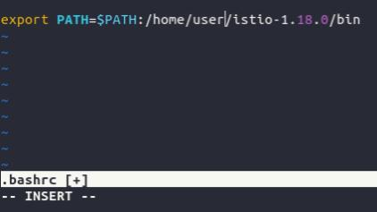
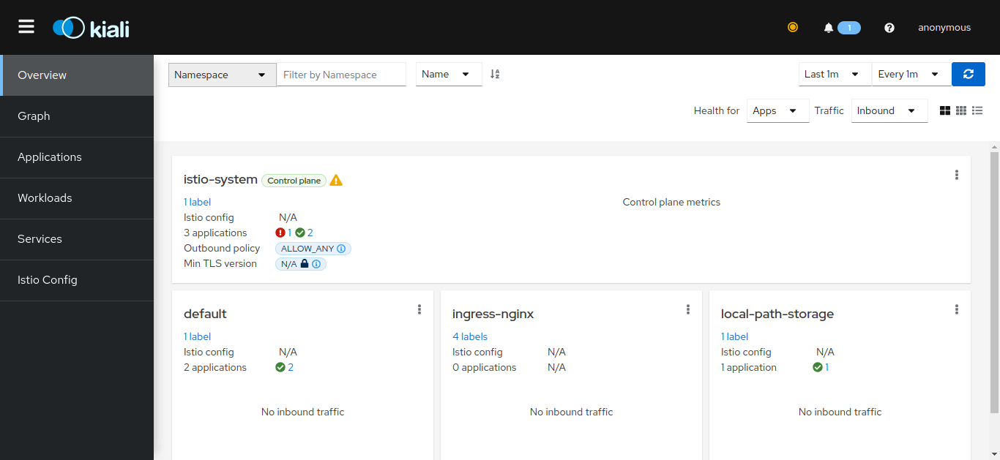

# tpe-redes

El proyecto se probó para computadoras con Linux x86_64 (expecíficamente Ubuntu 22.04.2 LTS).

## Autores

- Juan Martín Barmasch <jbarmasch@itba.edu.ar>
- Mateo Bartellini Huapalla <mbartellini@itba.edu.ar>
- Juan Negro <jnegro@itba.edu.ar>

## Requisitos

- `docker`, `docker compose`
- `kubectl`
- `kind`
- `istio`

### Instalación de Docker

1. Primero, actualizamos el índice de la herramienta `apt` e instalamos paquetes para usar repositorios sobre HTTPS:

```shell
  $ sudo apt-get update
  $ sudo apt-get install ca-certificates curl gnupg
```

2. Agregamos la llave GPG oficial de Docker:

```shell
  $ sudo install -m 0755 -d /etc/apt/keyrings
  $ curl -fsSL https://download.docker.com/linux/ubuntu/gpg | sudo gpg --dearmor -o /etc apt/keyrings/docker.gpg
  $ sudo chmod a+r /etc/apt/keyrings/docker.gpg
```

3. Configuramos el repositorio:

```shell
  $ echo \
  "deb [arch="$(dpkg --print-architecture)" signed-by=/etc/apt/keyrings/docker.gpg] https://download.docker.com/linux/ubuntu \
  "$(. /etc/os-release && echo "$VERSION_CODENAME")" stable" | \
  sudo tee /etc/apt/sources.list.d/docker.list > /dev/null
```

4. Volvemos a actualizar el índice de paquetes de `apt`

```shell
  $ sudo apt-get update
```

5. Instalamos Docker Engine, containerd y Docker Compose:

```shell
  $ sudo apt-get install docker-ce docker-ce-cli containerd.io docker-buildx-plugin docker-compose-plugin
```

6. Verificamos la correcta instalación de Docker Engine corriente la imagen `hello-world`:

```shell
  $ sudo docker run hello-world
```

Se debería ver una salida similar en la consola:

```shell
Hello from Docker!
This message shows that your installation appears to be working correctly.

To generate this message, Docker took the following steps:
 1. The Docker client contacted the Docker daemon.
 2. The Docker daemon pulled the "hello-world" image from the Docker Hub.
    (amd64)
 3. The Docker daemon created a new container from that image which runs the
    executable that produces the output you are currently reading.
 4. The Docker daemon streamed that output to the Docker client, which sent it
    to your terminal.

To try something more ambitious, you can run an Ubuntu container with:
 $ docker run -it ubuntu bash

Share images, automate workflows, and more with a free Docker ID:
 https://hub.docker.com/

For more examples and ideas, visit:
 https://docs.docker.com/get-started/
```

Para poder correr docker sin ser usuario root, se deben realizar los siguientes pasos:

1. Crear el grupo `docker`.

```shell
   $ sudo groupadd docker
```

2. Agregar el usuario actual al grupo `docker`.

```shell
 $ sudo usermod -aG docker $USER
```

3. Cerrar y volver a iniciar sesión para actualizar los cambios.
   Si se está corriendo Linux en una máquina virtual, es posible que sea necesario reiniciar la máquina virtual.

4. Verificar que se puede correr el comando `docker` sin `sudo`.
   ```bash
   $ docker run hello-world
   ```
   Se debería ver una salida en la consola como la indicada anteriormente con `sudo docker run hello-world`.

### Instalación de kind

Si se cuenta con `Homebrew`:

```shell
  $ brew install kind
```

Si no:

```shell
  $ [ $(uname -m) = x86_64 ] && curl -Lo ./kind https://kind.sigs.k8s.io/dl/v0.19.0/kind-linux-amd64
  $ chmod +x ./kind
  $ sudo mv ./kind /usr/local/bin/kind
```

Esto también instala kubectl.

### Instalación de Istio

1. Descargamos el archivo _release_ de Istio (versión 1.18.0):

```shell
  $ curl -L https://istio.io/downloadIstio | ISTIO_VERSION=1.18.0 TARGET_ARCH=x86_64 sh -
```

2. Nos movemos al directorio recién creado:

```shell
  $ cd istio-1.18.0
```

3. Imprimimos el directorio actual:

```shell
  $ pwd
```

Recibiendo un resultado similar a:

```shell
  $ /home/user/istio-1.18.0
```

4. Agregamos la línea `export PATH=$PATH:${ISTIO_BIN}` a nuestro archivo .bashrc o nuestro archivo _run commands_ de preferencia, donde reemplazamos `${ISTIO_BIN}` por el resultado del paso 3 más `/bin`:
   Por ejemplo:
   
5. Reiniciamos la shell y probamos corriendo el comando `istioctl --help`, deberíamos ver algo similar a:

```shell
  $ istioctl --help
  Istio configuration command line utility for service operators to
  ...
  Use "istioctl [command] --help" for more information about a command.
```

## Instalación del proyecto

Para correr el proyecto, lo único que hace falta es levantar la base de datos y el _cluster_ de Kubernetes. De aquí en adelante, cada sección empieza con su _working directory_ siendo el directorio raíz del proyecto.

### Base de datos

1. Para levantar la base de datos, primero abriremos una terminal y entraremos al directorio `db`:

```shell
  $ cd db
```

2. Luego, levantaremos el _container_ de Docker configurado:

```shell
  $ docker compose up
```

Deberíamos ver una salida similar a:

```shell
[+] Building 0.0s (0/0)
[+] Running 1/0
 ✔ Container postgres  Created 0.0s
...
postgres  | 2023-06-08 00:51:27.848 UTC [1] LOG:  database system is ready to accept connections

```

3. Si en la salida anterior encontramos lo siguiente ("could not bind IPv4 address"):

```shell
postgres  | 2023-06-08 00:54:27.879 UTC [1] LOG:  could not bind IPv4 address "0.0.0.0": Address already in use
postgres  | 2023-06-08 00:54:27.879 UTC [1] HINT:  Is another postmaster already running on port 5432? If not, wait a few seconds and retry.
```

Significa que nuestro _container_ entró en conflicto con la versión local de postgresql. Por ahora detenemos nuestra instancia local corriendo:

```shell
  $ sudo systemctl stop postgresql
```

Y volvemos a intentar el paso 2.

4. Verificamos una última vez que el _container_ esté corriendo a través del comando `docker ps`:

```shell
  $ docker ps
...   IMAGE                  ...                  CREATED       STATUS         ...                       NAMES
...   postgres:13.3          ...                  5 seconds...  Up 5 seconds   ...                       postgres
```

### Cluster de kubernetes

Lo único que hace falta es correr lo siguiente:

```shell
  $ chmod u+x setup-cluster.sh
  $ ./setup-cluster.sh
```

Pero ahora veremos qué hace cada uno de los comandos y posibles reparaciones de errores, lo cual es más notorio al correrlos por separado:

#### Explicación del script de configuración

1. Creación del cluster

```shell
kind create cluster --config k8s/cluster-config.yaml
```

El comando anterior crea a través de `kind` el _cluster_ de kubernetes. Kind crea los nodos a partir de _containers_ de Docker, por lo que después de correr el comando anterior, si corremos `docker ps`, deberíamos ver 3 nuevos contenedores con nombres "redes-cluster-control-plane", "redes-cluser-worker" y "redes-cluster-worker2".

2. Instalación de istio y _add-ons_ en el _cluster_

```shell
istioctl install -y
kubectl apply -f prometheus/
kubectl apply -f kiali/
```

3. Configuración de _namespaces_

```shell
kubectl apply -f namespaces/
kubectl label namespace default istio-injection=enabled
kubectl label namespace ingress-nginx istio-injection=enabled
```

Creamos los _namespaces_ que vamos a usar y configuramos para que istio pueda manejar las comunicaciones.

4. Creación de imágenes de las APIs

```shell
cd ./src/v1 && docker-compose build
cd ../v2 && docker-compose build
```

Creamos las imágenes de las distintas versiones de nuestra API.

5. Carga de imágenes al cluster

```shell
cd ../../
kind load docker-image v1-redes-api v2-redes-api --name redes-cluster
```

Con el último comando, cargamos las imágenes de nuestra API al cluster de kubernetes, ya que basamos nuestros containers en sus imágenes y no las tenemos cargadas en un _registry_.

6. Configuración de los _pods_ de nuestra API

```shell
kubectl apply -f src/
kubectl apply -f src/v1/k8s/
kubectl apply -f src/v2/k8s/
```

Con los anteriores comandos, vamos a aplicar los archivos de configuración de los _deployments_, _services_ y _endpoints_ a nuestro _cluster_ de kubernetes.

7. Instalación y configuración de nginx en el _cluster_

```shell
kubectl apply -f ingress-nginx/controller-deploy.yaml
kubectl wait --namespace ingress-nginx --for=condition=ready pod --selector=app.kubernetes.io/component=controller --timeout=120s && kubectl apply -f ingress-nginx/ingress-nginx.yaml
```

Con la primera línea, estamos instalando nginx como _ingress_ en el _cluster_ de kubernetes. Con la segunda, estamos esperando a que se terminen de crear los _pods_. Así, cuando se encuentran _running_, podemos configurar la redirección que hacemos desde la entrada del _cluster_ a nuestras distintas versiones de la API.

8. Redirección de puertos

```shell
kubectl port-forward --namespace=ingress-nginx service/ingress-nginx-controller 8084:80
```

Con el anterior comando, redirigimos nuestro tráfico local en el puerto de la izquierda al puerto 80 interno del _cluster_. Si queremos configurar para que el puerto local sea el 80, deberemos usar `sudo`.

## Uso del proyecto

Después de haber seguido los pasos de "Instalación del proyecto", podemos hacer los siguientes pedidos:

```shell
curl 127.0.0.1:8080/[version]/restaurant
curl 127.0.0.1:8080/[version]/restaurant/[id]
```

donde `[version]` puede ser `v1` o `v2` y `[id]` es un identificador de restaurante que, si se usa la base de datos provista en este proyecto, es un número que va entre 1 y 34.

También, si se corre el siguiente comando:

```shell
curl 127.0.0.1:8080/[version]
```

donde `[version]` cumple los mismos requisitos que en los comandos anteriores, se debería obtener una salida que incluya la siguiente línea:

`{"message":"Hello! I am: [version]-redes-api-[nombre_pod]"}`

donde `[version]` es la misma versión que se aclaró en el `curl` y `[nombre pod]` permite identificar al pod en que se está corriendo la API.

Alternativamente, se puede ingresar a los paths a los que se les hace `curl` desde un web browser.

Finalmente, si se corre el comando `istioctl dashboard kiali` se debería abrir en un browser un dashboard como el siguiente:

